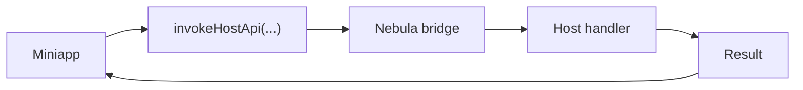
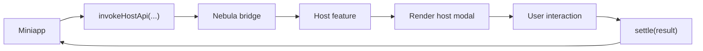

import { Step, Steps } from 'fumadocs-ui/components/steps';

توفّر Nebula نموذجًا موحدًا لقدرات المضيف يدعم نوعين من واجهات API المخصصة: Modal API (تحتاج إلى واجهة UI) وPure handler API (بدون UI). كما توفّر مجموعة مكوّنات متعددة المنصات.

## واجهات API المخصصة

### أنواع API

| النوع | المصنع | الاستخدام |
|---|---|---|
| Modal API | `createHostModalApiFeature(...)` | واجهات تحتاج UI من المضيف (المسح، معاينة الصور) |
| Pure handler API | `createHostApiFeature(...)` | واجهات بدون UI (الموقع، الحافظة) |

#### تدفق Pure handler API



#### تدفق Modal API



مراجع ذات صلة:

- [`createHostApiFeature(options)`](/docs/reference/nebula-sdk#createhostapifeatureoptions)
- [`createHostModalApiFeature(options)`](/docs/reference/nebula-sdk#createhostmodalapifeatureoptions)
- [`createHostModalChannel()`](/docs/reference/nebula-sdk#createhostmodalchannel)

<Info title="حول حقل description">
	يقبل كل من `createHostApiFeature(options)` و`createHostModalApiFeature(options)` حقل `description`، لكنه اختياري.

	هذا الحقل مخصص لتكامل MCP مستقبلًا، وتوليد الوثائق آليًا، واكتشاف القدرات. إذا رغبت فرقكم بدعم أدوات أفضل مستقبلًا، فمن المفيد تعبئته مبكرًا.
</Info>

### مثال Modal API: scanCode

تُعد `scanCode` مثالًا نموذجيًا لـ Modal API في Nebula. فيما يلي التدفق الكامل.

<Steps>
<Step>

#### تعريف API جانب miniapp (`@nebula-rn/client`)

```ts
// scanCode في @nebula-rn/client
import { Miniapp } from '@nebula-rn/sdk';

type ScanCodeOptions = {
	onlyFromCamera?: boolean;
	scanType?: string[];
};

type ScanCodeResult = {
	result: string;
	scanType: string;
	charSet: string;
	rawData: string;
};

async function scanCode(options: ScanCodeOptions = {}): Promise<ScanCodeResult> {
	const result = await Miniapp.invokeHostApi<ScanCodeData>(
		'scanCode',           // اسم API ويجب أن يطابق اسم المضيف
		options,              // معطيات الطلب
		'1.0',               // الحد الأدنى للإصدار
		120000,               // المهلة (مللي ثانية)
	);

	return result.ok
		? toScanCodeSuccessResult(result.data)
		: toScanCodeFailureResult(result.error);
}
```

</Step>
<Step>

#### إنشاء Modal Channel على جانب المضيف

```ts
import { createHostModalChannel } from '@nebula-rn/sdk';

// إنشاء قناة لإدارة فتح/إغلاق الـ Modal ونتائجه
const scanCodeChannel = createHostModalChannel<{
	onlyFromCamera?: boolean;
	scanTypes: string[];
}>();
```

توفّر القناة الدوال التالية:

| الدالة | الوصف |
|------|-------|
| `open(request)` | فتح الـ Modal وإرجاع Promise للنتيجة |
| `settle(result)` | تعيين النتيجة وإغلاق الـ Modal |
| `getCurrent()` | الحصول على الطلب الحالي |
| `subscribe(listener)` | الاشتراك في تغييرات حالة الطلب |
| `clear()` | مسح الطلب الحالي |

</Step>
<Step>

#### تسجيل ميزة المضيف (`@nebula-rn/host-apis`)

في المضيف، الكائن المسجل هو ميزة المضيف. في المسح يمكن تسميته `scanCodeHostApi`:

```tsx
import { createHostModalApiFeature, createHostApiFailure } from '@nebula-rn/sdk';
import { Camera } from 'react-native-vision-camera';
import NebulaHostScanModal from './NebulaHostScanModal';

export const scanCodeHostApi = createHostModalApiFeature({
	apiName: 'scanCode',
	description: {
		summary: 'فتح Modal مسح يديره المضيف وإرجاع النتيجة.',
		tags: ['camera', 'scanner', 'modal'],
	},
	component: NebulaHostScanModal,
	channel: scanCodeChannel,
	createRequest: payload => ({
		onlyFromCamera: payload.onlyFromCamera,
		scanTypes: normalizeScanTypes(payload.scanType),
	}),
	onBeforeOpen: async () => {
		const permission = await Camera.requestCameraPermission();
		if (permission !== 'granted') {
			return createHostApiFailure(
				'PERMISSION_DENIED',
				'scanCode:fail permission denied',
			);
		}
		return null;
	},
	onUnmountErrorMessage: 'scanCode:fail host scanner was unmounted before completion',
});
```

يمكن تقسيم المسؤوليات إلى مستويين:

- `scanCodeHostApi`
	- كائن الميزة الذي يُسجَّل في Nebula runtime على المضيف
	- يتم توجيه نداءات miniapp إلى هذه الميزة
- `NebulaHostScanModal`
	- مكوّن UI على جانب المضيف خلال التفاعل
	- يُستخدم لعمليات المسح أو المعاينة أو التأكيد

أي أن `scanCodeHostApi` يعرّف كيفية ربط القدرة بالمضيف، بينما `NebulaHostScanModal` يعرّف كيفية عرضها للمستخدم أثناء التشغيل.

فيما يلي مثال مبسّط على `NebulaHostScanModal`:

```tsx
import React, { useEffect, useState } from 'react';
import { Button, Text, View } from 'react-native';
import { NebulaAPI } from '@nebula-rn/sdk';
import { scanCodeChannel } from './scanCodeRuntime';

export default function NebulaHostScanModal() {
	const [request, setRequest] = useState(scanCodeChannel.getCurrent());

	useEffect(() => {
		return scanCodeChannel.subscribe(setRequest);
	}, []);

	if (!request) {
		return null;
	}

	const closeWithSuccess = async () => {
		await NebulaAPI.dismissHostModal();
		scanCodeChannel.settle({
			ok: true,
			data: {
				result: 'MOCK-CODE',
				scanType: 'qrCode',
			},
		});
	};

	return (
		<View>
			<Text>أنواع المسح: {request.scanTypes.join(', ')}</Text>
			<Button title="إتمام المسح" onPress={closeWithSuccess} />
		</View>
	);
}
```

هذا المثال يتجاهل الأذونات والتعرّف والاستثناءات، لكنه يوضح النقاط الأساسية لـ Modal API:

- قراءة الطلب الحالي عبر القناة
- قيام المضيف برسم المكوّن
- إغلاق الـ Modal وإرجاع النتيجة بعد التفاعل

</Step>
<Step>

#### التسجيل داخل تطبيق المضيف

```tsx
import { NebulaAPI } from '@nebula-rn/sdk';
import { scanCodeHostApi } from '@nebula-rn/host-apis';

export default NebulaAPI.wrap({
	serverBaseURL: 'https://api.example.com',
	hostApis: [scanCodeHostApi],
})(App);
```

</Step>
<Step>

#### الاستدعاء من miniapp

```ts
import { scanCode } from '@nebula-rn/client';

const result = await scanCode({ scanType: ['qrCode', 'barCode'] });
console.log('نتيجة المسح:', result.result);
```

</Step>
</Steps>

### مثال Pure handler API: getLocation

لواجهات API التي لا تحتاج إلى UI، استخدم `createHostApiFeature`. فيما يلي مثال كامل باستخدام `getLocation`.

<Steps>
<Step>

#### تعريف API جانب miniapp

```ts
import { Miniapp } from '@nebula-rn/sdk';

type GetLocationResult = {
	latitude: number;
	longitude: number;
};

export async function getLocation(): Promise<GetLocationResult> {
	const result = await Miniapp.invokeHostApi<GetLocationResult>(
		'getLocation',
		{},
		'1.0.0',
	);

	if (!result.ok) {
		throw new Error(result.error.message);
	}

	return result.data;
}
```

</Step>
<Step>

#### تسجيل API داخل المضيف

```ts
import { createHostApiFeature } from '@nebula-rn/sdk';

export const getLocationHostApi = createHostApiFeature({
	apiName: 'getLocation',
	supported: true,
	version: '1.0',
	description: {
		summary: 'الحصول على الموقع الحالي',
		tags: ['location'],
	},
	handle: async (payload) => {
		const location = await getCurrentPosition();
		return {
			ok: true,
			data: {
				latitude: location.latitude,
				longitude: location.longitude,
			},
		};
	},
});
```

</Step>
<Step>

#### التركيب داخل تطبيق المضيف

```tsx
import { NebulaAPI } from '@nebula-rn/sdk';
import { getLocationHostApi } from './src/apis/getLocationHostApi';

export default NebulaAPI.wrap({
	serverBaseURL: 'https://api.example.com',
	hostApis: [getLocationHostApi],
})(App);
```

</Step>
<Step>

#### الاستدعاء من صفحة miniapp

```tsx
import { Button, Text, View } from '@nebula-rn/components';
import { useState } from 'react';
import { getLocation } from '../../client/getLocation';

export default function LocationPage() {
	const [text, setText] = useState('لم يتم الحصول على الموقع');

	const handlePress = async () => {
		const result = await getLocation();
		setText(`${result.latitude}, ${result.longitude}`);
	};

	return (
		<View>
			<Text>{text}</Text>
			<Button title="الحصول على الموقع" onPress={handlePress} />
		</View>
	);
}
```

</Step>
</Steps>

### صيغة نتائج API

تعيد كل Host APIs صيغة موحدة للنتائج:

```ts
// نجاح
{ ok: true, data: { ... } }

// فشل
{ ok: false, error: { code: 'PERMISSION_DENIED', message: '...' } }

// API غير مدعومة
{ ok: false, error: { code: 'UNSUPPORTED', message: '...' } }
```

## المكوّنات المدمجة

توفر Nebula مجموعة مكوّنات UI متعددة المنصات عبر `@nebula-rn/components`.

### المكوّنات المتاحة

| المكوّن | الوصف |
|--------|-------|
| `Camera` | كاميرا لالتقاط الصور والفيديو |
| `Map` | عرض الخرائط والتفاعل معها |
| `Progress` | شريط تقدم |
| `RichText` | عرض نصوص غنية (HTML) |
| `Slider` | منزلق اختيار |
| `Swiper` | شرائح الصور مع مؤشرات الصفحات |
| `Video` | مشغل فيديو |
| `WebView` | محتوى ويب مدمج |

### طريقة الاستخدام

```tsx
import { View, Text, Swiper, Video, RichText } from '@nebula-rn/components';

function MyPage() {
	return (
		<View>
			<Text>Hello World</Text>
			<Swiper items={images} autoplay />
			<Video src="https://example.com/video.mp4" />
			<RichText nodes="<h1>عنوان</h1><p>نص المحتوى</p>" />
		</View>
	);
}
```

## مثال Modal API

`scanCodeHostApi` هو كائن الميزة الذي يُسجّل في المضيف، بينما المكوّن modal على جانب المضيف هو الواجهة التي يراها المستخدم أثناء التفاعل.

## Example Pure API

استخدم `createHostApiFeature(...)` عندما لا تحتاج إلى عرض واجهة على المضيف.

## مرجع

- [`createHostApiFeature(options)`](/docs/reference/nebula-sdk#createhostapifeatureoptions)
- [`createHostModalApiFeature(options)`](/docs/reference/nebula-sdk#createhostmodalapifeatureoptions)
- [`createHostModalChannel()`](/docs/reference/nebula-sdk#createhostmodalchannel)
