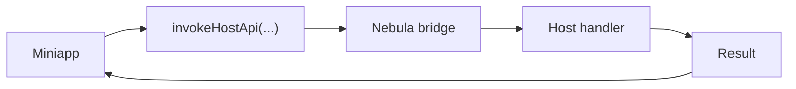
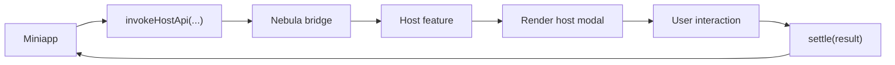

import { Step, Steps } from 'fumadocs-ui/components/steps';

Nebula provides a standardized host feature model that supports two types of custom APIs: Modal APIs (need UI) and pure handler APIs (no UI). It also provides a set of built-in cross-platform components.

## Custom APIs

### API types

| Type | Factory | Typical use case |
|---|---|---|
| Modal API | `createHostModalApiFeature(...)` | APIs that require host UI (scan, image preview) |
| Pure handler API | `createHostApiFeature(...)` | APIs without UI (location, clipboard) |

#### Pure handler API flow



#### Modal API flow



Related references:

- [`createHostApiFeature(options)`](/docs/reference/nebula-sdk#createhostapifeatureoptions)
- [`createHostModalApiFeature(options)`](/docs/reference/nebula-sdk#createhostmodalapifeatureoptions)
- [`createHostModalChannel()`](/docs/reference/nebula-sdk#createhostmodalchannel)

<Info title="About description">
  `createHostApiFeature(options)` and `createHostModalApiFeature(options)` both accept a `description` field, but it is optional.

  This field is reserved for future MCP integration, automated documentation, and capability discovery. If your team wants better tooling support later, consider filling it in early.
</Info>

### Modal API example: scanCode

`scanCode` is a typical Modal API in Nebula. Below is the full implementation flow.

<Steps>
<Step>

#### Define the miniapp API (`@nebula-rn/client`)

```ts
// scanCode API in @nebula-rn/client
import { Miniapp } from '@nebula-rn/sdk';

type ScanCodeOptions = {
  onlyFromCamera?: boolean;
  scanType?: string[];
};

type ScanCodeResult = {
  result: string;
  scanType: string;
  charSet: string;
  rawData: string;
};

async function scanCode(options: ScanCodeOptions = {}): Promise<ScanCodeResult> {
  const result = await Miniapp.invokeHostApi<ScanCodeData>(
    'scanCode',           // API name, must match Host registration
    options,              // request payload
    '1.0',               // minimum required version
    120000,               // timeout (ms)
  );

  return result.ok
    ? toScanCodeSuccessResult(result.data)
    : toScanCodeFailureResult(result.error);
}
```

</Step>
<Step>

#### Create a host-side modal channel

```ts
import { createHostModalChannel } from '@nebula-rn/sdk';

// Create a channel to manage modal open/close and result
const scanCodeChannel = createHostModalChannel<{
  onlyFromCamera?: boolean;
  scanTypes: string[];
}>();
```

The channel provides:

| Method | Description |
|------|-------------|
| `open(request)` | Open the modal and return a Promise for the result |
| `settle(result)` | Set the result and close the modal |
| `getCurrent()` | Get the current request |
| `subscribe(listener)` | Subscribe to request state changes |
| `clear()` | Clear the current request |

</Step>
<Step>

#### Register the host feature (`@nebula-rn/host-apis`)

In the Host, the registered object is the host feature. For scanning, it could be named `scanCodeHostApi`:

```tsx
import { createHostModalApiFeature, createHostApiFailure } from '@nebula-rn/sdk';
import { Camera } from 'react-native-vision-camera';
import NebulaHostScanModal from './NebulaHostScanModal';

export const scanCodeHostApi = createHostModalApiFeature({
  apiName: 'scanCode',
  description: {
    summary: 'Open a host-managed scan modal and return the scan result.',
    tags: ['camera', 'scanner', 'modal'],
  },
  component: NebulaHostScanModal,
  channel: scanCodeChannel,
  createRequest: payload => ({
    onlyFromCamera: payload.onlyFromCamera,
    scanTypes: normalizeScanTypes(payload.scanType),
  }),
  onBeforeOpen: async () => {
    const permission = await Camera.requestCameraPermission();
    if (permission !== 'granted') {
      return createHostApiFailure(
        'PERMISSION_DENIED',
        'scanCode:fail permission denied',
      );
    }
    return null;
  },
  onUnmountErrorMessage: 'scanCode:fail host scanner was unmounted before completion',
});
```

You can split responsibilities into two layers:

- `scanCodeHostApi`
  - the feature object registered into Nebula runtime on the Host
  - miniapp `scanCode` calls are routed to this feature
- `NebulaHostScanModal`
  - the host UI component used during interaction
  - used for scanning, preview, or confirmation flows

In other words, `scanCodeHostApi` defines how the capability is wired into the Host, while `NebulaHostScanModal` defines how it is presented at runtime.

Here is a simplified `NebulaHostScanModal` example:

```tsx
import React, { useEffect, useState } from 'react';
import { Button, Text, View } from 'react-native';
import { NebulaAPI } from '@nebula-rn/sdk';
import { scanCodeChannel } from './scanCodeRuntime';

export default function NebulaHostScanModal() {
  const [request, setRequest] = useState(scanCodeChannel.getCurrent());

  useEffect(() => {
    return scanCodeChannel.subscribe(setRequest);
  }, []);

  if (!request) {
    return null;
  }

  const closeWithSuccess = async () => {
    await NebulaAPI.dismissHostModal();
    scanCodeChannel.settle({
      ok: true,
      data: {
        result: 'MOCK-CODE',
        scanType: 'qrCode',
      },
    });
  };

  return (
    <View>
      <Text>Scan types: {request.scanTypes.join(', ')}</Text>
      <Button title="Complete scan" onPress={closeWithSuccess} />
    </View>
  );
}
```

This example omits camera permissions, scan recognition, and error handling, but it shows the key points of Modal APIs:

- read current request via the channel
- render a host component
- close the modal and return the result after interaction completes

</Step>
<Step>

#### Register in the Host app

```tsx
import { NebulaAPI } from '@nebula-rn/sdk';
import { scanCodeHostApi } from '@nebula-rn/host-apis';

export default NebulaAPI.wrap({
  serverBaseURL: 'https://api.example.com',
  hostApis: [scanCodeHostApi],
})(App);
```

</Step>
<Step>

#### Call from the miniapp

```ts
import { scanCode } from '@nebula-rn/client';

const result = await scanCode({ scanType: ['qrCode', 'barCode'] });
console.log('Scan result:', result.result);
```

</Step>
</Steps>

### Pure handler API example: getLocation

For APIs that do not need UI, use `createHostApiFeature`. Below is a full example with `getLocation`.

<Steps>
<Step>

#### Define the miniapp API

```ts
import { Miniapp } from '@nebula-rn/sdk';

type GetLocationResult = {
  latitude: number;
  longitude: number;
};

export async function getLocation(): Promise<GetLocationResult> {
  const result = await Miniapp.invokeHostApi<GetLocationResult>(
    'getLocation',
    {},
    '1.0.0',
  );

  if (!result.ok) {
    throw new Error(result.error.message);
  }

  return result.data;
}
```

</Step>
<Step>

#### Register the API in the Host

```ts
import { createHostApiFeature } from '@nebula-rn/sdk';

export const getLocationHostApi = createHostApiFeature({
  apiName: 'getLocation',
  supported: true,
  version: '1.0',
  description: {
    summary: 'Get current location',
    tags: ['location'],
  },
  handle: async (payload) => {
    const location = await getCurrentPosition();
    return {
      ok: true,
      data: {
        latitude: location.latitude,
        longitude: location.longitude,
      },
    };
  },
});
```

</Step>
<Step>

#### Mount in the Host app

```tsx
import { NebulaAPI } from '@nebula-rn/sdk';
import { getLocationHostApi } from './src/apis/getLocationHostApi';

export default NebulaAPI.wrap({
  serverBaseURL: 'https://api.example.com',
  hostApis: [getLocationHostApi],
})(App);
```

</Step>
<Step>

#### Call from a miniapp page

```tsx
import { Button, Text, View } from '@nebula-rn/components';
import { useState } from 'react';
import { getLocation } from '../../client/getLocation';

export default function LocationPage() {
  const [text, setText] = useState('Location not fetched');

  const handlePress = async () => {
    const result = await getLocation();
    setText(`${result.latitude}, ${result.longitude}`);
  };

  return (
    <View>
      <Text>{text}</Text>
      <Button title="Get location" onPress={handlePress} />
    </View>
  );
}
```

</Step>
</Steps>

### API result format

All Host APIs return a unified result format:

```ts
// success
{ ok: true, data: { ... } }

// failure
{ ok: false, error: { code: 'PERMISSION_DENIED', message: '...' } }

// API unsupported
{ ok: false, error: { code: 'UNSUPPORTED', message: '...' } }
```
