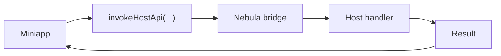
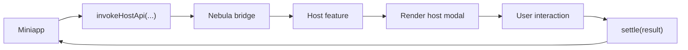

import { Step, Steps } from 'fumadocs-ui/components/steps';

Nebula 提供了标准化的宿主特性模型，支持两种类型的自定义 API：Modal API（需要 UI 交互）和纯处理 API（无 UI）。同时提供了一组内置的跨平台组件。

## 自定义 API

### API 类型

| 类型       | 工厂函数                         | 适用场景                                       |
| ---------- | -------------------------------- | ---------------------------------------------- |
| Modal API  | `createHostModalApiFeature(...)` | 需要宿主弹出交互界面的 API（如扫码、图片预览） |
| 纯处理 API | `createHostApiFeature(...)`      | 不需要 UI 的 API（如获取位置、读取剪贴板）     |

#### 纯处理 API 流程



#### Modal API 流程



相关 Reference：

- [`createHostApiFeature(options)`](/docs/reference/nebula-sdk#createhostapifeatureoptions)
- [`createHostModalApiFeature(options)`](/docs/reference/nebula-sdk#createhostmodalapifeatureoptions)
- [`createHostModalChannel()`](/docs/reference/nebula-sdk#createhostmodalchannel)

<Info title="关于 description 参数">
  `createHostApiFeature(options)` 和 `createHostModalApiFeature(options)` 的 `options`
  都提供了 `description` 参数，但它不是必填参数。

这个字段主要是为后续的 MCP 集成、自动化文档生成和能力发现功能预留的。如果你的团队希望未来更好地支持工具链和文档化能力，建议尽早补充它。

</Info>

### Modal API 示例：scanCode

`scanCode` 是 Nebula 中 Modal API 的典型实现。以下是完整的实现流程。

<Steps>
<Step>

#### 定义小程序端 API（`@nebula-rn/client`）

```ts
// @nebula-rn/client 中的 scanCode API
import { Miniapp } from '@nebula-rn/sdk';

type ScanCodeOptions = {
  onlyFromCamera?: boolean;
  scanType?: string[];
};

type ScanCodeResult = {
  result: string;
  scanType: string;
  charSet: string;
  rawData: string;
};

async function scanCode(
  options: ScanCodeOptions = {},
): Promise<ScanCodeResult> {
  const result = await Miniapp.invokeHostApi<ScanCodeData>(
    'scanCode', // API 名称，需与宿主注册名一致
    options, // 请求参数
    '1.0', // 最低版本要求
    120000, // 超时时间（毫秒）
  );

  return result.ok
    ? toScanCodeSuccessResult(result.data)
    : toScanCodeFailureResult(result.error);
}
```

</Step>
<Step>

#### 创建宿主端 Modal Channel

```ts
import { createHostModalChannel } from '@nebula-rn/sdk';

// 创建 channel，用于管理 Modal 的打开/关闭和结果传递
const scanCodeChannel = createHostModalChannel<{
  onlyFromCamera?: boolean;
  scanTypes: string[];
}>();
```

Channel 提供以下方法：

| 方法                  | 说明                              |
| --------------------- | --------------------------------- |
| `open(request)`       | 打开 Modal，返回 Promise 等待结果 |
| `settle(result)`      | 设置结果并关闭 Modal              |
| `getCurrent()`        | 获取当前请求                      |
| `subscribe(listener)` | 订阅请求状态变化                  |
| `clear()`             | 清除当前请求                      |

</Step>
<Step>

#### 注册宿主特性（`@nebula-rn/host-apis`）

在 Host 中，真正参与注册的是宿主特性对象。以扫码能力为例，这个对象可以命名为 `scanCodeHostApi`：

```tsx
import { createHostModalApiFeature, createHostApiFailure } from '@nebula-rn/sdk';
import { Camera } from 'react-native-vision-camera';
import NebulaHostScanModal from './NebulaHostScanModal';

export const scanCodeHostApi = createHostModalApiFeature({
  apiName: 'scanCode',
  description: {
    summary: '打开宿主管理的扫码 Modal，返回扫码结果。',
    tags: ['camera', 'scanner', 'modal'],
  },
  component: NebulaHostScanModal,
  channel: scanCodeChannel,
  createRequest: payload => ({
    onlyFromCamera: payload.onlyFromCamera,
    scanTypes: normalizeScanTypes(payload.scanType),
  }),
  onBeforeOpen: async () => {
    const permission = await Camera.requestCameraPermission();
    if (permission !== 'granted') {
      return createHostApiFailure(
        'PERMISSION_DENIED',
        'scanCode:fail permission denied',
      );
    }
    return null;
  },
  onUnmountErrorMessage:
    'scanCode:fail host scanner was unmounted before completion',
});
```

这里可以把职责分成两层：

- `scanCodeHostApi`
  - 宿主注册到 Nebula 运行时的 API 特性对象
  - 小程序调用 `scanCode` 时，请求会被路由到这个特性
- `NebulaHostScanModal`
  - 该特性在交互阶段使用的宿主侧 UI 组件
  - 用于承载扫码、预览或授权确认等需要界面的流程

也就是说，`scanCodeHostApi` 定义的是“这项能力如何接入 Host”，而 `NebulaHostScanModal` 负责“这项能力在运行时如何呈现给用户”。

下面是一个简化版的 `NebulaHostScanModal` 示例：

```tsx
import React, { useEffect, useState } from 'react';
import { Button, Text, View } from 'react-native';
import { NebulaAPI } from '@nebula-rn/sdk';
import { scanCodeChannel } from './scanCodeRuntime';

export default function NebulaHostScanModal() {
  const [request, setRequest] = useState(scanCodeChannel.getCurrent());

  useEffect(() => {
    return scanCodeChannel.subscribe(setRequest);
  }, []);

  if (!request) {
    return null;
  }

  const closeWithSuccess = async () => {
    await NebulaAPI.dismissHostModal();
    scanCodeChannel.settle({
      ok: true,
      data: {
        result: 'MOCK-CODE',
        scanType: 'qrCode',
      },
    });
  };

  return (
    <View>
      <Text>Scan types: {request.scanTypes.join(', ')}</Text>
      <Button title="完成扫码" onPress={closeWithSuccess} />
    </View>
  );
}
```

这个示例省略了相机权限、扫码识别和异常处理，但已经体现了 Modal API 的关键点：

- 通过 channel 读取当前请求
- 由 Host 渲染宿主组件
- 在交互完成后关闭 modal 并回传结果

</Step>
<Step>

#### 在宿主 App 中注册

```tsx
import { NebulaAPI } from '@nebula-rn/sdk';
import { scanCodeHostApi } from '@nebula-rn/host-apis';

export default NebulaAPI.wrap({
  serverBaseURL: 'https://api.example.com',
  hostApis: [scanCodeHostApi],
})(App);
```

</Step>
<Step>

#### 小程序中调用

```ts
import { scanCode } from '@nebula-rn/client';

const result = await scanCode({ scanType: ['qrCode', 'barCode'] });
console.log('扫码结果:', result.result);
```

</Step>
</Steps>

### 纯处理 API 示例：getLocation

对于不需要 UI 的 API，使用 `createHostApiFeature`。下面用 `getLocation` 做一个完整示例：

<Steps>
<Step>

#### 定义小程序端 API

```ts
import { Miniapp } from '@nebula-rn/sdk';

type GetLocationResult = {
  latitude: number;
  longitude: number;
};

export async function getLocation(): Promise<GetLocationResult> {
  const result = await Miniapp.invokeHostApi<GetLocationResult>(
    'getLocation',
    {},
    '1.0.0',
  );

  if (!result.ok) {
    throw new Error(result.error.message);
  }

  return result.data;
}
```

</Step>
<Step>

#### 在 Host 中注册 API

```ts
import { createHostApiFeature } from '@nebula-rn/sdk';

export const getLocationHostApi = createHostApiFeature({
  apiName: 'getLocation',
  supported: true,
  version: '1.0',
  description: {
    summary: '获取当前地理位置',
    tags: ['location'],
  },
  handle: async payload => {
    const location = await getCurrentPosition();
    return {
      ok: true,
      data: {
        latitude: location.latitude,
        longitude: location.longitude,
      },
    };
  },
});
```

</Step>
<Step>

#### 在宿主 App 中挂载

```tsx
import { NebulaAPI } from '@nebula-rn/sdk';
import { getLocationHostApi } from './src/apis/getLocationHostApi';

export default NebulaAPI.wrap({
  serverBaseURL: 'https://api.example.com',
  hostApis: [getLocationHostApi],
})(App);
```

</Step>
<Step>

#### 在小程序页面中调用

```tsx
import { Button, Text, View } from '@nebula-rn/components';
import { useState } from 'react';
import { getLocation } from '../../client/getLocation';

export default function LocationPage() {
  const [text, setText] = useState('未获取位置');

  const handlePress = async () => {
    const result = await getLocation();
    setText(`${result.latitude}, ${result.longitude}`);
  };

  return (
    <View>
      <Text>{text}</Text>
      <Button title="获取位置" onPress={handlePress} />
    </View>
  );
}
```

</Step>
</Steps>

### API 结果格式

所有宿主 API 返回统一的结果格式：

```ts
// 成功
{ ok: true, data: { ... } }

// 失败
{ ok: false, error: { code: 'PERMISSION_DENIED', message: '...' } }

// API 不支持
{ ok: false, error: { code: 'UNSUPPORTED', message: '...' } }
```